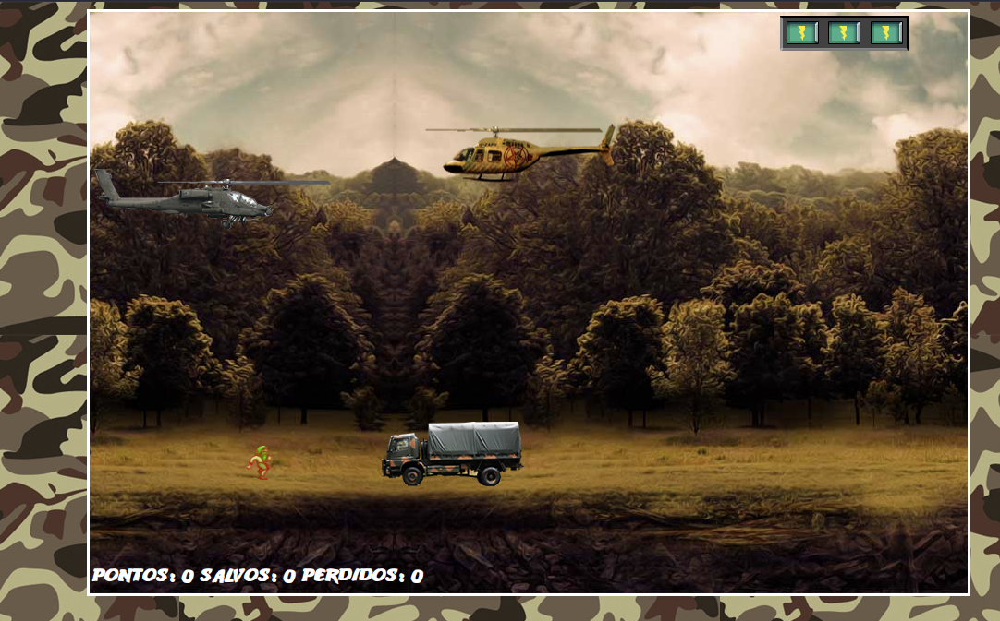

## Jogo Helicóptero JS

Olá Me chamo Jonathan Lima, Nesse projeto pode desenvolver um game de nave 
com as seguintes tecnologias: HTML, CSS, JAVASCRIPT E O FRAMEWORK JQUERY.

Onde você pode encontrar um jogo com a função Start, colisões, sons, disparos, contador de pontos, vidas, resgate e game over.

